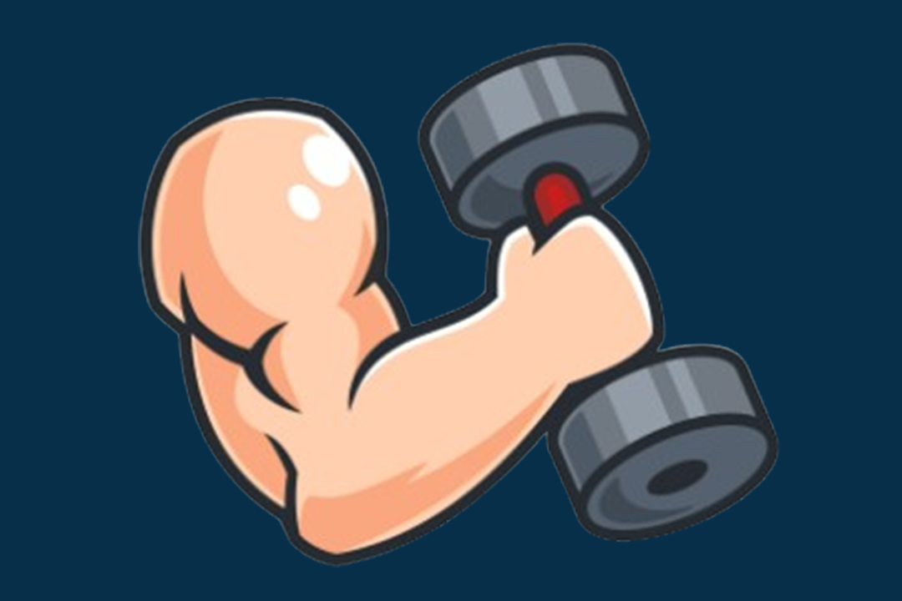

<h1 align="center">
  
</h1>

<h2 align="center">My GymBro is...</h2>

<strong>an Express.js application powered by Next.js, designed to be a personalized companion for novice and experienced health enthusiasts alike.</strong></h4>

## Tech Stack + How it Works

 \
The frontend is developed using `JavaScript` and the Next.js framework, with Tailwind CSS as the chosen `CSS` framework.

 
 \
The backend framework chosen for this project is Express, a `JavaScript`-based framework. Using Express, we created API endpoints to communicate with the frontend (the client).
With Cohere, these endpoints are designed to generate workout routines and meal plans for the user.

Here is a breakdown:
- The form sends route parameters to our backend.
- We fetch API endpoints from our expressjs backend to our frontend with router parameters of these inputted options
    - For example, when we fetch data from the API endpoint, we have route parameters for age, dietary restrictions, weight, and fitness goals 
- We then make a POST method to fetch a generated workout and meal plan based on these user inputted options.
- Once its generated, we parse the data and return it to the client, where our frontend renders it to the screen.

## Functionality

The GymBro team understands the challenges of starting a fitness journey, as they too faced the same roadblocks. Overwhelmed by the vast amount of information available, the team found creating a simple, tailored schedule crucial to their success.

From this experience, myGymBro was born, offering a personalized approach to fitness, catering to each user's unique goals. The app provides users with a weekly workout and meal plan schedule, tailored to their needs and preferences. Users can also look forward to delicious, nutritious recipes, recommended to keep energy levels high and support workout progress.

The GymBro team understands the challenges of starting a fitness journey, as they too faced the same roadblocks. Overwhelmed by the vast amount of information available, the team found creating a simple, tailored schedule crucial to their success.

From this experience, myGymBro was born, offering a personalized approach to fitness, catering to each user's unique goals. The app provides users with a weekly workout and meal plan schedule, tailored to their needs and preferences. Users can also look forward to delicious, nutritious recipes, recommended to keep energy levels high and support workout progress.

## What's Next!
- Optimization (Backend API Calls to Cohere)
- Providing more details for specific meals
- User accounts (tracking fitness progress)
- Images/visual changes
- More interactivity with the buttons

